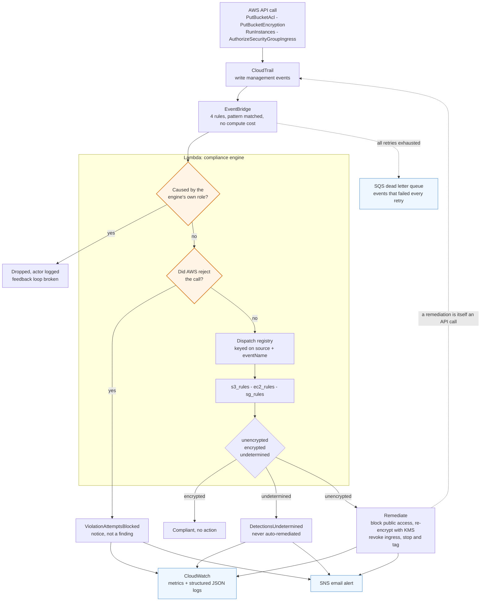

# Automated Cloud Compliance & Remediation Engine

A real-time, serverless system that watches an AWS account for security policy violations and **automatically fixes them** in seconds — no human in the loop.

When someone makes an S3 bucket public, launches an unencrypted EC2 instance, or opens SSH to the entire internet, this engine detects it the moment it happens and reverses it before it becomes an exposure.

---

## What It Does

| It detects... | It automatically... |
|---|---|
| An S3 bucket made publicly readable | Blocks all public access |
| A bucket's encryption reverted to the AWS-managed key instead of the mandated customer-managed KMS key | Re-applies the required SSE-KMS configuration |
| An EC2 instance with an unencrypted disk | Tags it with the violation and stops it, halting writes to the unencrypted volume while leaving it intact to be fixed |
| A security group opening SSH (22) or RDP (3389) to `0.0.0.0/0` | Revokes the offending rule |

Every action is logged, measured on a live dashboard, and alerted to a security team via email.

---

## Architecture at a Glance



The dotted line back to CloudTrail is the part that matters. Every remediation
is itself an API call, so it is logged and fed straight back in. The
self-invocation guard is what stops that becoming an unbounded loop, and it is
confirmed against a real CloudTrail record in
[entry 7 of the engineering log](docs/engineering-log.md).

Full diagrams are in [docs/architecture.md](docs/architecture.md).

---

## Tech Stack

| Layer | Technology |
|---|---|
| Compute | AWS Lambda (Python 3.12) |
| Event routing | Amazon EventBridge |
| Audit source | AWS CloudTrail |
| Observability | Amazon CloudWatch (Metrics, Logs, Alarms, Dashboard) |
| Alerting | Amazon SNS |
| Failure handling | Amazon SQS (Dead Letter Queue) |
| Infrastructure as Code | Terraform |
| AI layer | MCP (Model Context Protocol) server, read-only |
| Testing | pytest + unittest.mock, terraform test with mock_provider |

A full per-service breakdown is in [docs/services-explained.md](docs/services-explained.md).

---

## Project Structure

```
.
├── src/lambda/              # Python that runs inside Lambda
│   ├── handler.py           #   entry point + rule registry
│   ├── rules/               #   one module per AWS service
│   └── utils/               #   logging, metrics, notifications
├── mcp_server/              # Read-only MCP server (the AI layer)
│   ├── server.py            #   registers six tools over stdio
│   ├── aws_clients.py       #   the one read-only client factory
│   ├── free_agent.py        #   unattended loop, Groq or local Ollama ($0)
│   ├── agent.py             #   unattended loop, Anthropic (paid)
│   └── tools/               #   one module per question the tools answer
├── infrastructure/          # Terraform (all AWS resources)
│   └── tests/               #   .tftest.hcl suites, fully mocked
├── scripts/                 # check_prerequisites.py (CloudTrail preflight)
├── tests/                   # unit tests + captured CloudTrail events
└── docs/                    # documentation
```

---

## AI Layer: Read-Only MCP Server

The engine remediates. This layer lets you *ask it questions*.

`mcp_server/` is an [MCP](https://modelcontextprotocol.io) server that exposes
the engine's telemetry as tools an AI model can call. Point Claude Code at it and
ask "why did sg-0abc123 alert?" in English; the model decides which tools to
call, in what order, and answers from real data.

**No LLM sits in the remediation path.** The engine is deterministic and responds
in seconds. Putting a model in that decision would make it slower and less
predictable. The model does the slow, ambiguous, human-facing part: explaining
what happened.

### The tools

| Tool | Answers | Source |
|---|---|---|
| `describe_engine_rules` | What does this engine check, and how does it fix it? | This repo. No AWS call. |
| `get_compliance_posture` | How are we doing over the last N hours? | CloudWatch metrics |
| `search_compliance_logs` | What happened, and who did it? | CloudWatch Logs Insights |
| `get_resource_history` | What has this resource done? | CloudWatch Logs Insights |
| `get_resource_state` | Is this resource compliant right now? | EC2 / S3 describe calls |
| `list_exemptions` | Who has opted out of compliance? | Resource Groups Tagging API |

There is no `triage` tool, deliberately. Ask why a resource alerted and the model
composes `get_resource_history`, `get_resource_state` and `describe_engine_rules`
on its own. Tools are shaped around questions, not around API endpoints.

### Read-only, enforced in three layers

1. **No write code path exists.** A model cannot be prompted into calling a
   function that is not there.
2. **A test proves it.** `tests/unit/test_mcp_read_only.py` parses the AST of
   every module in the package and fails on any call beginning with a mutating
   verb. Further tests prove the guard catches `start_instances` and still
   allows `start_query`, so it is not passing by finding nothing.
3. **An optional IAM policy.** `create_mcp_reader_policy = true` creates an
   identity that grants only `Describe`, `Get`, `List` and `StartQuery`. A
   terraform test asserts that, so the Python and IAM layers cannot disagree.

### Absence of evidence is not evidence of compliance

Every tool that can return nothing says what nothing means. An empty metric
window, a missing log group, a resource with no history and a failed exemption
lookup each return a `warning` rather than an empty success, and the server
instructs the model to surface it. "No violations found" and "the engine never
saw this" are indistinguishable from the caller's side, and only one of them is
good news.

### Setup

```bash
pip install -r requirements-mcp.txt
```

`.mcp.json` at the repo root registers the server with Claude Code:

```json
{
  "mcpServers": {
    "compliance-engine": {
      "command": "python",
      "args": ["-m", "mcp_server.server"],
      "env": { "COMPLIANCE_REGION": "us-east-1" }
    }
  }
}
```

Restart Claude Code in this directory and it picks the server up.

**`COMPLIANCE_REGION` is required and never inherited.** boto3 would otherwise
fall back to your CLI's configured region, which is not necessarily where the
engine is deployed, and every query would come back empty — reading as "no
violations" rather than "wrong region". Set it to `aws_region` from your tfvars.

| Variable | Default | Purpose |
|---|---|---|
| `COMPLIANCE_REGION` | *required* | Region the engine is deployed in |
| `COMPLIANCE_LOG_GROUP` | `/aws/lambda/compliance-engine-prod` | Lambda log group to query |
| `COMPLIANCE_NAMESPACE` | `ComplianceEngine` | CloudWatch metric namespace |

### A demo conversation

> **you:** What does this compliance engine check for?
>
> *calls `describe_engine_rules` — no AWS needed, so this works before anything
> is deployed*
>
> **you:** Anything been exempted recently?
>
> *calls `get_compliance_posture`, sees a non-zero `ExemptionsApplied`, then
> `list_exemptions` to name the resources*
>
> **you:** Why did sg-0abc123 alert?
>
> *calls `get_resource_history` for what the engine logged, `get_resource_state`
> for whether the rule is still open, and answers with both*

### Optional: running it unattended

The MCP server above is driven by a human in a chat window. Two agents run the
same tools in a loop with nobody watching, so the engine can be queried from a
schedule or an event.

**Free** — `mcp_server/free_agent.py`, via Groq's free tier or a fully local
Ollama:

```bash
pip install openai
export COMPLIANCE_REGION=us-east-1
export GROQ_API_KEY=...                  # omit to use local Ollama instead
python -m mcp_server.free_agent "anything exempted this week?"
```

**Paid** — `mcp_server/agent.py`, via the Anthropic API. The only thing in this
project that costs money per run:

```bash
pip install -r requirements-agent.txt
export ANTHROPIC_API_KEY=...
python -m mcp_server.agent "anything exempted this week?"
```

Both read their tool definitions from the MCP server rather than redeclaring
them, so adding a tool there makes it available to both with no second list to
keep in sync. That is not incidental: a hand-written tool list for the free
agent declared four of the six tools, which fails silently, because a model
never calls a tool it was not told about.

Both loops are capped at eight turns. Neither spends anything at import time or
under test — the APIs are mocked throughout, and both SDKs are imported lazily,
so the modules and their tests work without either installed.

### Tests

```bash
python -m pytest -q                      # includes the MCP suite
cd infrastructure && terraform test      # includes the IAM read-only assertions
```

Every MCP test is fully mocked. `tests/conftest.py` fails any test that
constructs a real boto3 client, so the suite cannot quietly reach AWS.

---

## Getting Started

### Prerequisites

- [Terraform](https://www.terraform.io/) >= 1.5
- Python 3.12
- AWS credentials configured (`aws configure`)
- **A CloudTrail trail that is enabled and logging write management events** in
  the target region, or a multi-region trail. See below.

#### The CloudTrail requirement is not optional, and it fails silently

EventBridge only delivers `AWS API Call via CloudTrail` events when a trail is
enabled and logging. CloudTrail **Event history**, which is always on, is not
enough — it is a 90-day console view, not a trail.

Without a trail, `terraform apply` succeeds, every resource reports healthy, the
dashboard renders, and no event ever arrives. Nothing errors anywhere. This is
the one failure mode of this project that does not announce itself, so check for
it rather than assuming:

```bash
python scripts/check_prerequisites.py
```

That makes only read-only calls (`DescribeTrails`, `GetTrailStatus`,
`GetEventSelectors`) and prints exactly what is missing. Exit code 0 means the
engine will actually receive events.

If the account has no trail, set `create_cloudtrail = true` in your tfvars and
this project will create a management-events-only, multi-region trail with its
own bucket.

**Leave it `false` if a trail already exists.** AWS delivers the first copy of
management events in each Region free of charge; a second trail carrying the
same events is billed as an additional copy. Most real accounts already have one
from an Organizations trail, Control Tower, or Security Hub, so creating another
duplicates both the audit path and the bill.

The trail this project creates is `WriteOnly` management events, no data events,
because all four rules match write management events. If you add a rule for a
read-only event, widen the trail to `All` **and** set that EventBridge rule's
state to `ENABLED_WITH_ALL_CLOUDTRAIL_MANAGEMENT_EVENTS` — default-enabled rules
only match write management events.

### 1. Run the tests
```bash
pip install -r requirements-dev.txt
pytest
```

### 2. Configure your deployment
Copy the example variables file and set your alert email:
```bash
cp example.tfvars terraform.tfvars
# edit terraform.tfvars → set alert_email to your address
```

### 3. Check the account prerequisites
```bash
python scripts/check_prerequisites.py --region us-east-1
```
Read-only, costs nothing. Do this before deploying and again afterwards.

**Pass the region the engine is deployed in**, or set `COMPLIANCE_REGION`.
CloudTrail and EventBridge are regional, and without it the check falls back to
your AWS CLI default — which may be somewhere the engine was never deployed.
A pass against the wrong region is worse than a failure.

### 4. Deploy
```bash
cd infrastructure
terraform init
terraform plan -var-file=../terraform.tfvars
terraform apply -var-file=../terraform.tfvars
```

After apply, check your inbox and **confirm the SNS email subscription**. Then open the dashboard URL printed in the Terraform outputs.

### 5. Tear down
```bash
terraform destroy -var-file=../terraform.tfvars
```

---

## How to Test It Live

Once deployed, trigger a violation and watch it self-heal:

```bash
# Create a test bucket and make it public — the engine will lock it back down within seconds
aws s3api create-bucket --bucket my-test-bucket-$RANDOM --region us-east-1
aws s3api put-bucket-acl --bucket <bucket-name> --acl public-read

# Within seconds, check the bucket — public access will be blocked
aws s3api get-public-access-block --bucket <bucket-name>
```

You'll receive an email alert and the violation will appear on the CloudWatch dashboard.

---

## Safety Features

- **Exemptions** — Tag any resource `ComplianceExempt = true` to opt it out of remediation (for legitimate cases like static-website buckets).
- **Least-privilege IAM** — The Lambda can only perform the exact API calls its rules require, nothing more.
- **Dead Letter Queue** — If a remediation fails after 3 attempts, the event is captured for manual review and a human is alerted.
- **Full audit trail** — Every detection and remediation is logged as structured JSON, queryable in CloudWatch Logs Insights.

---

## Documentation

| Document | Purpose |
|---|---|
| [docs/engineering-log.md](docs/engineering-log.md) | What broke and how I worked it out. The bugs my own tests were passing over, and what each one taught me. Start here if you want to know whether I understand this system or just assembled it. |
| [docs/build-log.md](docs/build-log.md) | Every design decision, explained in detail with the alternatives I considered |
| [docs/architecture.md](docs/architecture.md) | System diagrams and resource inventory |
| [docs/services-explained.md](docs/services-explained.md) | What each AWS service is and why I used it |

---

## Extending It

Adding a new compliance rule takes two steps:

1. Implement an `evaluate(event_name, detail)` function in a module under `src/lambda/rules/`.
2. Register it in `_RULE_REGISTRY` in [src/lambda/handler.py](src/lambda/handler.py) and add a matching EventBridge rule in [infrastructure/eventbridge.tf](infrastructure/eventbridge.tf).

No changes to the core handler logic are required.
